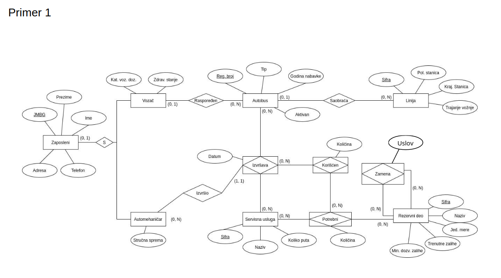
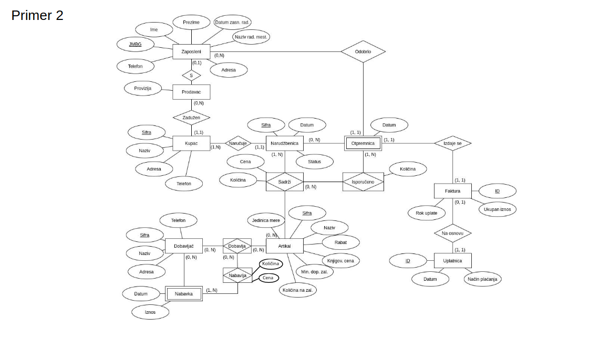
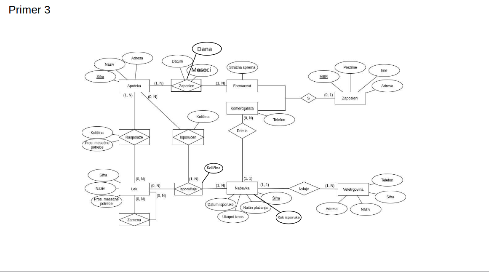
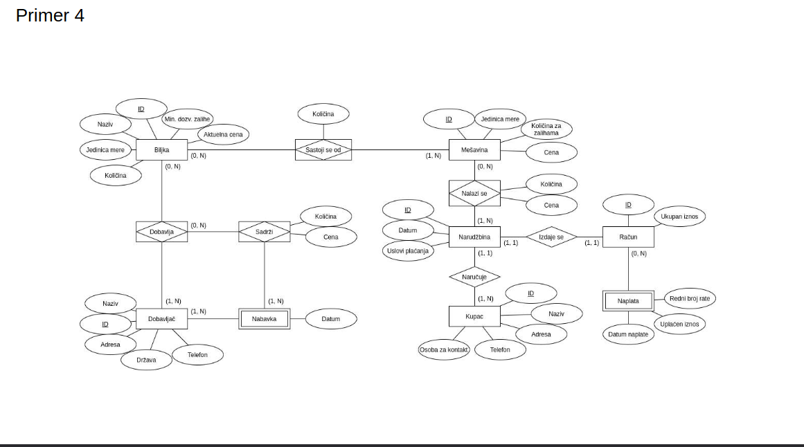
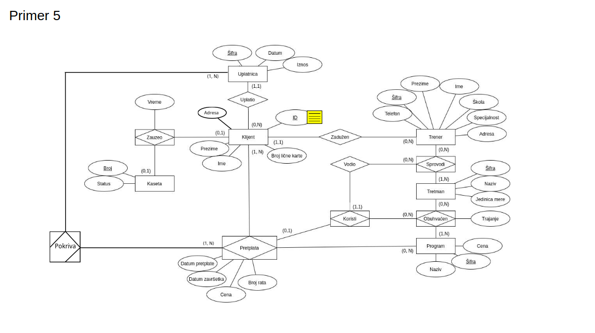
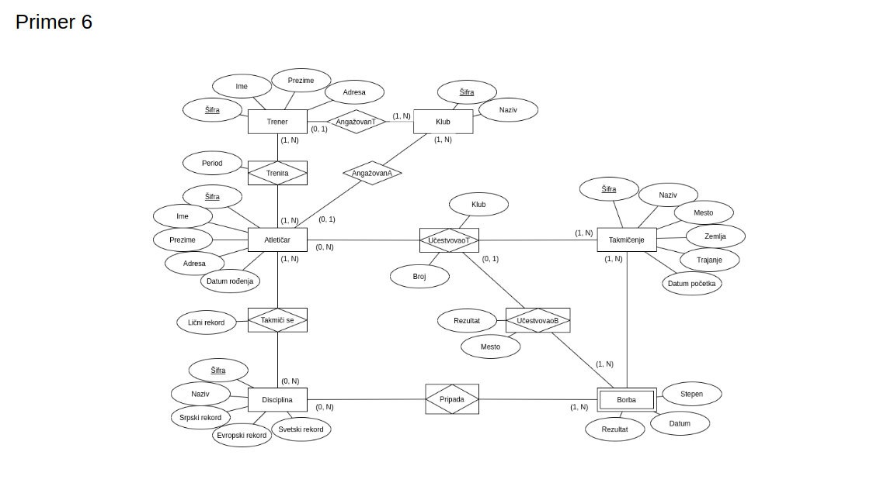
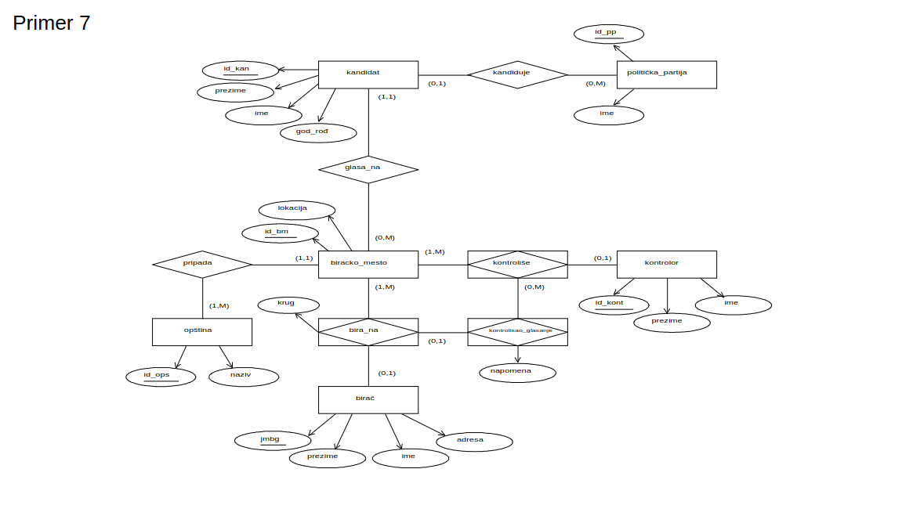
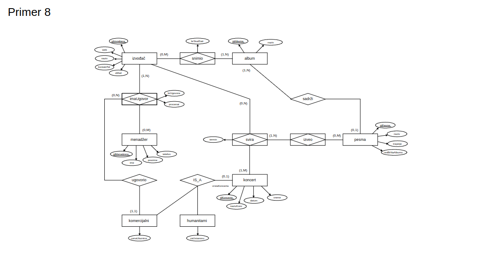

# Prevodjenje ER dijagrama u Relacije 


### PRAVILA:

```

K1. Prevode se svi nezavisni entiteti u posebne table:
  - Svi atributi entiteta postaju polja tabele;
  - Primarni kljuc entiteta postaje primarni kljuc tabele.
K2. Prevode se zavisni entiteti i specijalizacije u posebne tabele:
  - Svi atributi zavisnog/specijalizovanog entiteta postaju polja tabele;
  - Dodaje kao strani kljuc tj. primarni kljuc entiteta koji identifikuje taj zavisan entitet
    (odnosno, cini generalizaciju).
K3. Agregirani entiteti i relacije se prevode u zavisnosti od kardinalnosati na sledeci nacin:
  a) Ako je sa bar jedne strane kardinalnost (1, 1):
    - Ne pravimo pravimo novu tabelu, vec uzimamo primarni kljuc iz tabele KA kojoj je 
      kardinalnost (1, 1) i stavljamo ga, kao strani kljuc,  u tabelu OD koje je kardinalnost (1, 1);
    - Atributi koji pripadaju relaciji se dodaju tabeli, zajedno sa stranim
      kljucem, OD koje je kardinalnost (1, 1).
    
    E1 --(1,1)-- R --(?,?)-- E2
        --KA-->     <--OD--
        
    Primarni kljuc od E2 stavljamo kao strani kljuc u E1.
    Napomena: Samo u slucaju (1, 1) kardinalnosti ne prevodimo odnos u tabelu.
  
  b) Inace, ako je sa bar jedne strane kardinalnost (0, 1):
    - Pravimo novu tabelu koja se sastoji od:
      1. Primarnog kljuca entiteta od kojeg je kardinalnost (0, 1) - strani kljuc;
      2. Primarnog kljuca entiteta ka kojem je kardinalnost (0, 1) - strani kljuc;
      3. Svih atributa koji pripadaju tom odnosu na dijagramu.
    - Primarni kljuc je strani kljuc od tabele od koje je kardinalnost (0, 1)
    
    E1 --(0,1)-- R --(?,?)-- E2
        --KA-->     <--OD--
        
    Primarni kljuc je strani kljuc od E1.
    
  c) Inace, imamo vise-vise vezu:
    - Pravimo novu tabelu koja se sastoji od:
      1. Primarnog kljuca prvog entiteta - strani kljuc;
      2. Primarnog kljuca drugog kljuca - strani kljuc
      3. Svih atributa koji pripadaju toj relaciji;
      
    Primarni kljuc je unija stranih kljuceva.
         
```

### Zadatak 1:



```
Zaposleni(*JMBG, ime, prezime, adresa, telefon)
Autobus(*reg_broj, tip, god_nabavke, aktivan)
Linija(*sifra, polazna_stanica, krajnja_stanica, trajanje_voznje)
ServisnaUsluga(*sifra, naziv, koliko_puta)
RezervniDeo(*sifra, naziv, jed_mere, trenune_zalihe, min_dozvola_zaliha)

Vozac(*^JMBG, kat_voz_dozvol, zdravstveno_stanje)
  Vozac[JMBG] < Zaposleni[JMBG]

Automehanicar(*^JMBG, strucna_sprema)
  Automehanicar[JMBG] < Zaposleni[JMBG]

Rasporedjen(*^JMBG_vozaca, ^reg_broj_autobusa)
  Rasporedjen[JMBG_vozaca] < Vozac[JMBG]
  Rasporedjen[reg_broj_autobusa] < Autobus[reg_broj]

Saobraca(*^reg_broj_autobusa, ^sifra_linije)
  Saobraca[reg_broj_autobusa] < Autobus[reg_broj]
  Saobraca[sifra_linije] < Linja[sifra]

Potrebni(*^sifra_serv_usluge, *^sifra_rez_dela, kolicina)
  Potrebni[sifra_serv_usluge] < ServisnaUsluga[sifra]
  Potrebni[sifra_rez_dela] < RezervniDeo[sifra]

Izvrsava(*^reg_broj_autobusa, *^sifra_serv_usluge, datum, ^JMBG_automehanicara)
  Izvrsava[reg_broj_autobusa] < Autobus[reg_broj]
  Izvrsava[sifra_serv_usluge] < ServisnaUsluga[sifra]

Koriscen(*^reg_broj_autobusa, *^sifra_serv_usluge, *^sifra_rez_dela, kolicina)
  Koriscen[reg_broj_autobusa, sifra_serv_usluge] < Izvrsava[reg_broj_autobusa, sifra_serv_usluge]
  Koriscen[sifra_serv_usluge, sifra_rez_dela] < Potrebni[sifra_serv_usluge, sifra_rez_dela]

Zamena(*^sifra_rez_dela1, *^sifra_rez_dela2, uslov)
  Zamena[sifra_rez_dela1] < RezervniDeo[sifra]
  Zamena[sifra_rez_dela2] < RezervniDeo[sifra]
```

### Zadatak 2: 



```
Zaposleni(*JMBG, ime, prezime, datum_zasn_rad, naziv_rad_mesta, adresa, telefon)
Kupac(*sifra, naziv adresa, telefon, ^JMBG_prodavca)
  Kupac[JMBG_prodavca] < Prodavac[JMBG]

Narudzbenica(*sifra, datum, status, ^sifra_kupca)
  Narudzbenica[sifra_kupca] < Kupac[sifra]

Faktura(*id, ukupan_iznos, rok_uplate, ^sifra_narudzbenice)
  Faktura[sifra_narudzbenie] < Narudzbenica[sifra]

Uplatnica(*id, datum, nacin_placanja, ^id_fakture)
  Uplatnica[id_fakture] < Faktura[id]

Artikal(*sifra, naziv, rabat, knjigov_cena, min_dop_zal, jed_mere, kolicina_na_zalihama)
Dobavljac(*sifra, naziv, telefon, adresa)

Prodavac(*^JMBG, provizija)
  Prodavac[JMBG] < Zaposleni[JMBG]

Otpremnica(*^sifra_narudzbenice, datum, ^JMBG_zaposlenog)
  Otpremnica[sifra_narudzbenice] < Narudzbenica[sifra]
  Otpremnica[JMBG_zaposlenog] < Zaposleni[JMBG]

Nabavka(*^sifra_dobavljaca, datum, iznos)
  Nabavka[sifra_dobavljaca] < Dobavljac[sifra]

Sadrzi(*^sifra_narudzbenice, *^sifra_artikla, cena, kolicina)
  Sadrzi[sifra_narudzbenice] < Narudzbenica[sifra]
  Sadrzi[sifra_artika] < Artikal[sifra]

Isporuceno(*^sifra_narudzbenice, *^sifra_artikla, kolicina)
  Isporuceno[sifra_narudzbenice, sifra_artikla] < Sadrzi[sifra_narudzbenice, sifra_artikla]
  Isporuceno[sifra_narudzbenice] < Otpremnica[sifra_narudzbenice]

Dobavlja(*^sifra_dobavljaca, *^sifra_artikla)
  Dobavlja[sifra_dobavljaca] < Dobavljac[sifra]
  Dobavlja[sifra_artikla] < Artikal[sifra]

Nabavlja(*^sifra_dobavljaca, *^sifra_artikla, kolicina, cena)
  Nabavlja[sifra_dobavljaca] < Nabavka[sifra_dobavljaca]
  Nabavlja[sifra_dobavljaca, sifra_artikla] < Dobavlja[sifra_dobavljaca, sifra_artikla]
```

### Zadatak 3



```
K1:
Zaposleni(*MRB, ime, prezime, adresa)
Apoteka(*sifra, naziv, adresa)
Lek(*sifre, naziv, pros_mesecne_potrebe)
Nabavka(*sifra, rok_isporuke, nacin_placanja, ukupni_iznos, datum_isporuke, ^MBR_komercijaliste, ^sifra_veletrgovine)
  Nabavka[MBR_komercijaliste] < Komercijalista[MBR]
  Nabavka[sifra_veletrgovine] < Veletrgovina[sifra]

Veletrgovina(*sifra, telefon, naziv, adresa)

K2:
Farmaceut(*^MBR, strucna_sprema)
  Farmaceut[MBR] < Zaposleni[MBR]

Komercijalista(*^MBR, telefon)
  Komercijalista[MBR] < Zaposleni[MBR]

K3:
Zaposlen(*^sifra_apoteka, *^MBR_farmaceut, datum, dana, meseci)
  Zaposlen[sifra_apteka] < Apoteka[sifra]
  Zaposleni[MBR_farmaceut] < Farmaceut[MBR]

Raspolaze(*^sifra_apoteka, *^sifra_lek, kolicina, pros_mes_potrebe)
  Raspolaze[sifra_apoteka] < Apoteka[sifra]
  Raspolaze[sifra_lek] < Lek[sifra]

Isporucuje(*^sifra_lek, *^sifra_nabavka, kolicina)
  Isporucuje[sifra_lek] < Lek[sifra]
  Isporucuje[sifra_nabavka] < Nabavka[sifra]

Isporucen(*^sifra_lek, *^sifra_nabavka, *^sifra_apoteka, kolicina)
  Isporucen[sifra_lek, sifra_nabavka] < Isporucuje[sifra_lek, sifra_nabavka]
  Isporucen[sifra_apoteka] < Apoteka[sifra]

Zamena(*^sifra_lek1, *^sifra_lek2)
  Zamena[sifra_lek1] < Lek[sifra]
  Zamena[sifra_lek2] < Lek[sifra]
```

### Zadatak 4: ???



```
Biljka(*id, naziv, jed_mere, kolicina, min_dozv_zalihe, cena)
Dobavljac(*id, naziv, adresa, drzava, telefon)
Mesavina(*id, jed_mere, kolicina_za_zalihama, cena)
Narudzbina(*id, datum, uslovi_placanja, ^id_kupca)
  Narudzbina[id_kupca] < Kupac[id]

Kupac(*id, naziv, adresa, telefon, osoba_za_kontakt)
Racun(*id, ukupan_iznos, ^id_narudzbina)
  Racun[id_narudzbina] < Narudzbina[id]

Nabavka(*^id_dobavljaca, datum)
  nabavka[id_dobavljaca] < Dobavljac[id]

Naplata(*^id_racuna, redni_broj_rate, uplacen_iznos, datum_naplate)
  Naplata[id_racuna] < Racun[id]

SastojiSeOd(*^id_biljke, *^id_mesavine, kolicina)
  SastojiSeOd[id_biljke] < Biljka[id]
  SastojiSeOd[id_mesavine] < Mesavina[id]

NalaziSe(*^id_mesavine, *^id_narudzbine, kolicina, cena)
  NalaziSe[id_mesavine] < Mesavina[id]
  NalaziSe[id_narudzbine] < Narudzbina[id]

Dobavlja(*^id_biljke, *^id_dobavljaca)
  Dobavlja[id_biljke] < Biljka[id]
  Dobavlja[id_dobavljaca] < Dobavljac[id]

Sadrzi(*^id_biljke, *^id_dobavljaca, kolicina, cena)
  Sadrzi[id_biljke, id_dobavljaca] < Dobavlja[id_biljke, id_dobavljaca]
  Sadrzi[id_dobavljaca] < Nabavka[id_dobavljaca]


```

### Zadatak 5:



```
K1:
Uplatnica(*sifra, datum, iznos, ^id_klijenta)
  Uplatnica[id_klijenta] < Klijent[id]

Klijent(*id, br_licne_karte, ime, prezime, adresa, ^sifra_trenera)
  Klijent[sifra_trenera] < Trener[sifra]

Kaseta(*broj, status)
Trener(*sifra, ime, prezime, skola, telefon, specijalnost, adresa)
Tretman(*sifra, naziv, jed_mere)
Program(*sifra, naziv, cena)

K2:
Zauzeo(*^broj_kaseta, *^id_klijenta, vreme)
  Zauzeo[broj_kaseta] < Kaseta[broj]
  Zauzeo[id_klijenta] < Klijent[id]

Pretplata(*^id_klijenta, *^sifra_programa, broj_rata, dat_pretplate, dat_zavrsetka, cena)
  Pretplata[id_klijenta] < Klijenat[id]
  Pretplata[sifra_programa] < Program[sifra]

Sprovodi(*^sifra_trenera, *^sifra_tretmana)
  Sprovodi[sifra_trenera] < Trener[sifra]
  Sprovodi[sifra_tretmana] < Tretman[sifra]

Obuhvacen(*^sifra_tretmana, *^sifra_programa, trajanje)
  Obuhvacen[sifra_tretmana] < Tretman[sifra]
  Obuhvacen[sifra_programa] < Program[sifra]

Koristi(*^id_klijenta, *^sifra_programa, ^sifra_tretmana, ^sifra_trenera)
  Koristi[id_klijenta, sifra_programa] < Pretplata[id_klijenta, sifra_programa]
  Koristi[sifra_tretmana, sifra_programa] < Obuhvacen[sifra_tretmana, sifra_programa]
  Koristi[sifra_trenera] < Trener[sifra]

```

### Zadatak 6:



```
Trener(*sifra, ime, prezime, adresa)
Klub(*sifra, naziv)
Atleticar(*sifra, ime, prezime, adresa, dat_rodjenja)
Takmicenje(*sifra, naziv, mesto, zemlja, trajanje, dat_pocetka)
Disciplina(*sifra, naziv, srpski_rekord, evropski_rekord, svetski_rekord)
Borba(*^sifra_takmicenja, stepen, datum, rezultat)
  Borba[sifra_takmicenja] < Takmicenje[sifra]

AngazovanT(*^sifra_trener, ^sifra_klub)
  AngazovanT[sifra_trener] < Trener[sifra]
  AngazovanT[sifra_klub] < Klub[sifra]

AngazovanA(*^sifra_atleticar, ^sifra_klub)
  AngazovanA[sifra_atleticar] < Atleticar[sifra]
  AngazovanA[sifra_klub] < Klub[sifra]

Trenira(*^sifra_trener, *^sifra_atleticar, period)
  Trenira[sifra_trener] < Trener[sifra]
  Trenira[sifra_atleticar] < Atleticar[sifra]

TakmiciSe(*^sifra_atleticar, *^sifra_disciplina, licni_rekord)
  TakmiciSe[sifra_atleticar] < Atleticar[sifra]
  TakmiciSe[sifra_disciplina] < Disciplina[sifra]

Pripada(*^sifra_disciplina, *^sifra_takmicenje)
  Pripada[sifra_disciplina] < Disciplina[sifra]
  Pripada[sifra_takmicenje] < Borba[sifra_takmicenje]

UcestvovaoT(*^sifra_atleticar, *^sifra_takmicenje, klub, broj)
  UcestvovaoT[sifra_atleticar] < Atleticar[sifra]
  UcestvovaoT[sifra_takmicenje] < Takmicenje[sifra]

UcestvovaoB(*^sifra_atleticar, *^sifra_takmicenje, rezultat, mesto)
  UcestvovaoB[sifra_atleticar, sifra_takmicenje] < UcestvovaoT[sifra_atleticar, sifra_takmicenje]
  UcestvovaoB[sifra_takmicenje] < Borba[sifra_takmicenja]

```

### Zadatak 7:



```

PolitickaPartija(*id, ime, ^id_biracko_mesto)
  PolitickaPartija[id_biracko_mesto] < BirackoMesto[id]

Kandidat(*id, ime, prezime, god_rodjenja)
BirackoMesto(*id, lokacija, ^id_opstina)
  BirackoMesto[id_opstina] < Opstina[id]

Opstina(*id, naziv)
Kontrolor(*id, ime, prezime)
Birac(*JMBG, ime, prezime, adresa)

Kandiduje(*^id_kandidat, ^id_politicka_partija)
  Kandiduje[id_kandidat] < Kandidat[id]
  Kandiduje[id_politicka_pratija] < PolitickaPartija[id]

BiraNa(*^id_birac, ^id_biracko_mesto, krug)
  BiraNa[id_birac] < Birac[id]
  BiraNa[id_biracko_mesto] < BirackoMesto[id]

Kontrolise(*^id_kontrolor, ^id_biracko_mesto)
  Kontrolise[id_kontrolor] < Kontrolor[id]
  Kontrolise[id_biracko_mesto] < BirackoMesto[id]

KontrolisaoGlasanje(*^id_birac, *^id_biracko_mesto, ^id_kontrolor, napomena)
  KontrolisaoGlasanje[id_birac, id_biracko_mesto] < BiraNa[id_birac, id_biracko_mesto]
  KontrolisaoGlasanje[id_kontrolor, id_biracko_mesto] < Kontrolise[id_kontrolor, id_biracko_mesto]

```

### Zadatak 8:



```
Koncert(*id, datum, vreme, naziv)
Izvodjac(*id, web, naziv, telefon, email)
Album(*id, naziv)
Menadzer(*id, ime, prezime, telefon)
Pesma(id, naziv, trajanje, rbr)

Komercijalni(*^id_koncert, cena_ulaznice, ^id_izvodjac, ^id_menadzer)
  Komercijalni[id_koncert] < Koncert[id]
  Komercijalni[id_izvodjac] < Izvodjac[id]
  Komercijalni[id_menadzer] < Menadzer[id]

Humanitarni(*^id_koncert, za_ustanovu)
  Humanitarni[id_koncert] < Koncert[id]

Sadrzi(*^id_pesma, ^id_album)
  Sadrzi[id_pesma] < Pesma[id]
  Sadrzi[id_album] < Album[id]

Snimio(*^id_album, *^id_izvodjac, br_stud_sati)
  Snimio[id_album] < Album[id]
  Snimio[id_izvodjac] < Izvodjac[id]

Svira(*^id_izvodjac, *^id_koncert, termin)
  Svira[id_izvodjac] < Izvodjac[id]
  Svira[id_koncert] < Koncert[id]

ImaUgovor(*^id_izvodjac, *^id_menadzer, br_ugovora, procenat)
  ImaUgovor[id_izvodjac] < Izvodjac[id]
  ImaUgovor[id_menadzer] < Menadzer[id]

Izveo(*^id_pesma, *^id_izvodjac, *^id_koncert)
  Izveo[id_pesma] < Pesma[id]
  Izveo[id_izvodjac, id_koncert] < Svira[id_izvodjac, id_koncert]


```